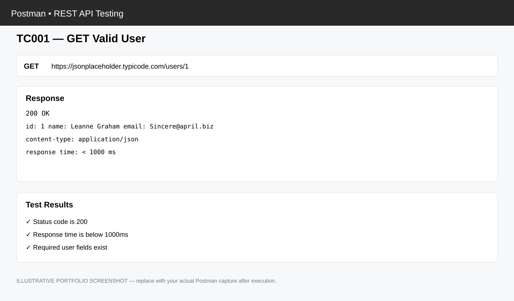
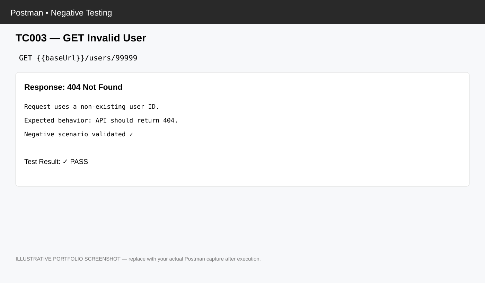
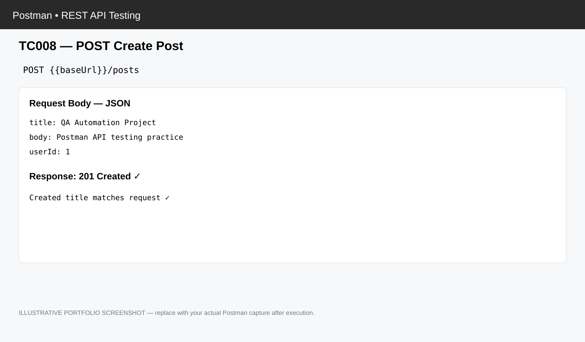
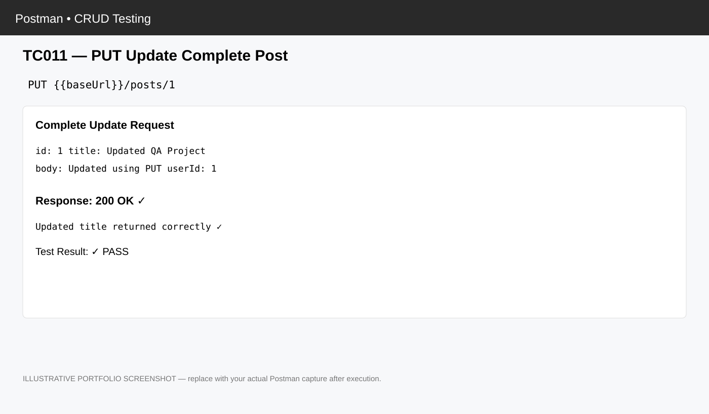
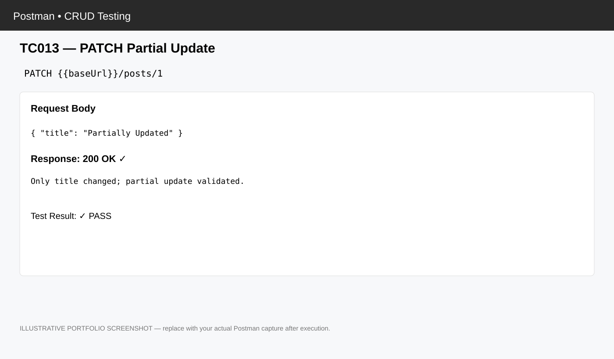
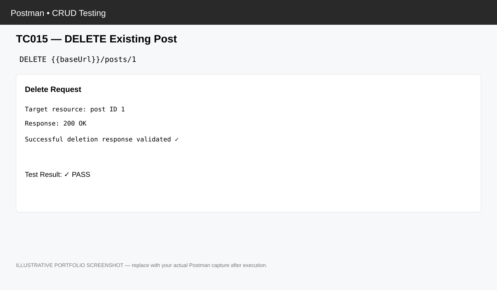
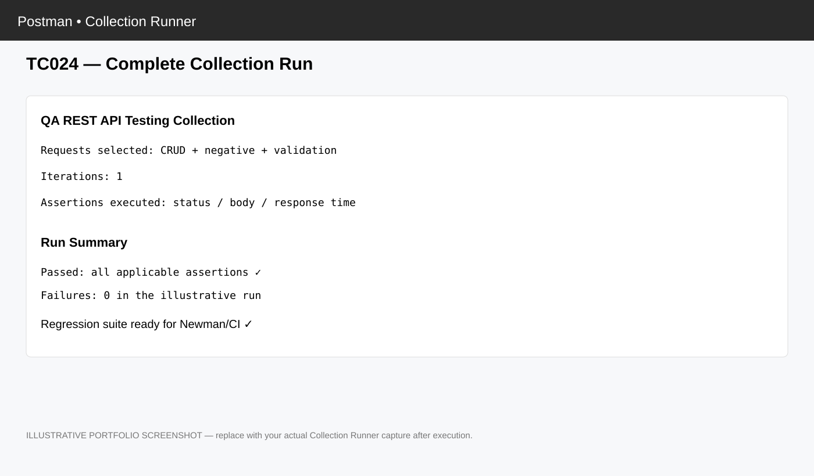

# 🚀 REST API Testing using Postman

<p align="center"><b>Interview-Ready QA / API Testing Portfolio Project</b><br>Postman • JavaScript Assertions • Newman • GitHub Actions</p>

<p align="center"></p>

> **Fresher QA portfolio:** a complete REST API testing example showing request design, CRUD testing, positive/negative scenarios, JavaScript assertions, documentation, Newman execution and GitHub Actions CI.

## 📌 What is this project?

This project demonstrates a practical QA workflow using the public **JSONPlaceholder** REST API. It is a learning/portfolio project and does not claim production testing experience for a real company.

**Base URL:** `https://jsonplaceholder.typicode.com`

### 🎯 Skills demonstrated

- REST API and HTTP fundamentals
- GET, POST, PUT, PATCH, DELETE
- Functional and negative testing
- JSON response validation
- Status-code, header and response-time validation
- JavaScript assertions in Postman
- Environment variables
- Test-case design and documentation
- Defect reporting approach
- Newman command-line execution
- GitHub Actions CI regression
- Git/GitHub

## 🔄 API Testing Flow

```text
Requirement → Test Scenario → Postman Request → API Response
                                      ↓
                              JavaScript Assertions
                                      ↓
                               Pass / Fail Result
                                      ↓
                              Collection Runner
                                      ↓
                                    Newman
                                      ↓
                              GitHub Actions CI
```

## 🧪 Test Coverage

| Method | Scenario | Main validation |
|---|---|---|
| GET | Valid user | 200 + required JSON fields |
| GET | All posts | 200 + array response |
| GET | Invalid user/post | Negative 404 validation |
| POST | Create post | 201 + created fields |
| PUT | Full update | 200 + updated fields |
| PATCH | Partial update | 200 + updated fields |
| DELETE | Delete post | Successful response |

## ✅ Example Postman Assertions

```javascript
pm.test("Status code is 200", () => {
    pm.response.to.have.status(200);
});

pm.test("Response time is below 1000ms", () => {
    pm.expect(pm.response.responseTime).to.be.below(1000);
});

pm.test("Required user fields exist", () => {
    const body = pm.response.json();
    pm.expect(body).to.have.property("id");
    pm.expect(body).to.have.property("name");
    pm.expect(body).to.have.property("email");
});
```

## 🌍 Environment Variables

| Variable | Example |
|---|---|
| `baseUrl` | `https://jsonplaceholder.typicode.com` |
| `userId` | `1` |
| `postId` | `1` |

## 📋 Test Cases

The project contains **25+ documented scenarios** with Test Case ID, module, HTTP method, endpoint, scenario, expected result, priority and test type.

- `TestCases/API_Test_Cases.csv`
- `TestCases/API_Test_Cases.xlsx`
- `TestCases/Test_Data.json`

## 📝 QA Documentation

- `Documentation/PROJECT_OVERVIEW.md` — project in one page
- `Documentation/INTERVIEW_READY_GUIDE.md` — interview explanation and questions
- `Documentation/API_Testing_Test_Plan.md` — test scope and approach
- `Documentation/API_Request_Reference.md` — endpoint reference
- `Documentation/TEST_EXECUTION_GUIDE.md` — execution steps
- `Documentation/Defect_Report_Template.md` — defect template

## ▶️ How to Run

### Postman

1. Import `Postman/API_Testing_Collection_v2.json`.
2. Import `Postman/QA_Environment.json`.
3. Select `QA-JSONPlaceholder-Environment`.
4. Run requests individually or with Collection Runner.
5. Review response and Test Results.

### Newman

```bash
npm install
npm test
```

## 🔄 GitHub Actions

`.github/workflows/api-tests.yml` runs the collection with Newman for CI regression on repository changes and supports manual execution.

# 📸 Test Case Screenshot Evidence

The `Screenshots/` folder now contains **one dedicated screenshot-style visual for every documented test case (TC001–TC025)**. The visuals are designed in a Postman-style layout so an interviewer can quickly understand the request, response, validation and expected outcome.

> **Transparency note:** these repository visuals are **illustrative portfolio mockups**, not claimed as screenshots captured from a live Postman run. After executing the collection yourself, replace each SVG with the corresponding real Postman screenshot if you want execution evidence.

### Featured evidence

| Test Case | Evidence |
|---|---|
| TC001 — GET Valid User |  |
| TC003 — GET Invalid User |  |
| TC008 — POST Create Post |  |
| TC011 — PUT Update Post |  |
| TC013 — PATCH Update |  |
| TC015 — DELETE Post |  |
| TC024 — Collection Run |  |

### Complete evidence index

- [TC001 — GET Valid User](Screenshots/TC001_GET_Valid_User.svg)
- [TC002 — GET User 2](Screenshots/TC002_GET_User_2.svg)
- [TC003 — GET Invalid User / 404](Screenshots/TC003_GET_Invalid_User_404.svg)
- [TC004 — GET Non-Numeric User ID](Screenshots/TC004_GET_NonNumeric_User_ID.svg)
- [TC005 — GET All Posts](Screenshots/TC005_GET_All_Posts.svg)
- [TC006 — GET Single Post](Screenshots/TC006_GET_Single_Post.svg)
- [TC007 — GET Invalid Post / 404](Screenshots/TC007_GET_Invalid_Post_404.svg)
- [TC008 — POST Create Post](Screenshots/TC008_POST_Create_Post.svg)
- [TC009 — POST Empty Body](Screenshots/TC009_POST_Empty_Body.svg)
- [TC010 — POST Missing userId](Screenshots/TC010_POST_Missing_UserId.svg)
- [TC011 — PUT Update Post](Screenshots/TC011_PUT_Update_Post.svg)
- [TC012 — PUT Invalid Post](Screenshots/TC012_PUT_Invalid_Post.svg)
- [TC013 — PATCH Update Title](Screenshots/TC013_PATCH_Update_Title.svg)
- [TC014 — PATCH Invalid Post](Screenshots/TC014_PATCH_Invalid_Post.svg)
- [TC015 — DELETE Post](Screenshots/TC015_DELETE_Post.svg)
- [TC016 — DELETE Invalid Post](Screenshots/TC016_DELETE_Invalid_Post.svg)
- [TC017 — Response Time Validation](Screenshots/TC017_Response_Time_Validation.svg)
- [TC018 — Content-Type Validation](Screenshots/TC018_Content_Type_Validation.svg)
- [TC019 — Required ID Field](Screenshots/TC019_Required_ID_Field.svg)
- [TC020 — Required Email Field](Screenshots/TC020_Required_Email_Field.svg)
- [TC021 — Array Response Validation](Screenshots/TC021_GET_Array_Response.svg)
- [TC022 — Environment userId](Screenshots/TC022_Environment_UserId.svg)
- [TC023 — Environment postId](Screenshots/TC023_Environment_PostId.svg)
- [TC024 — Collection Runner](Screenshots/TC024_Collection_Run.svg)
- [TC025 — Execution Reporting](Screenshots/TC025_Reporting.svg)

## 📁 Repository Structure

```text
REST-API-Testing-Postman/
├── .github/workflows/api-tests.yml
├── Documentation/
├── Postman/
├── TestCases/
├── Screenshots/
│   ├── TC001_*.svg
│   ├── TC002_*.svg
│   ├── ...
│   └── TC025_*.svg
├── .gitignore
├── package.json
└── README.md
```

## 🎤 60-Second Interview Answer

> “I created a REST API testing project using Postman on the JSONPlaceholder API. I covered GET, POST, PUT, PATCH and DELETE operations with positive and negative scenarios. I added JavaScript assertions for status codes, response fields, response type and response time. I used environment variables for reusable configuration and documented more than 25 test scenarios. I also configured Newman for command-line execution and GitHub Actions for API regression in CI.”

## ❓ Questions to Prepare

**Why Postman?** It is convenient for creating, organizing and executing API requests and supports JavaScript assertions.

**PUT vs PATCH?** PUT is generally used for a complete update; PATCH is for a partial update.

**Why Newman?** It executes Postman collections from the command line, making them suitable for CI.

**Why GitHub Actions?** To run API regression automatically when repository changes occur.

**What if a test fails?** Inspect request, headers, body, status and response; reproduce the issue; compare expected vs actual; document a clear defect.

## ⚠️ Portfolio Disclaimer

JSONPlaceholder is a public fake API for testing and prototyping. This repository is a learning/portfolio project and does not claim production testing experience for a real company.

<p align="center"><b>QA Automation / API Testing Portfolio Project</b></p>
